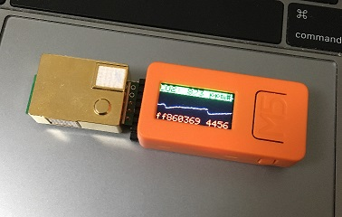
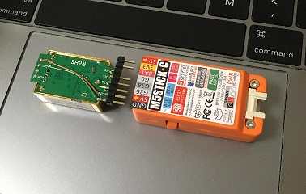

# M5StickC CO2 Monitor

This is a CO2 concentration monitor sketch for M5StickC and MH-Z19B module.

# Pin Assignment

| M5StickC | MH-Z19B |
| -------- | ------- |
| GND      | GND     |
| 5V       | VIN     |
| G26      | N.C.    |
| G36      | Tx      |
| G0       | Rx      |
| BAT      | Vo      |
| 3V3      | N.C.    |
| VIN      | N.C.    |

